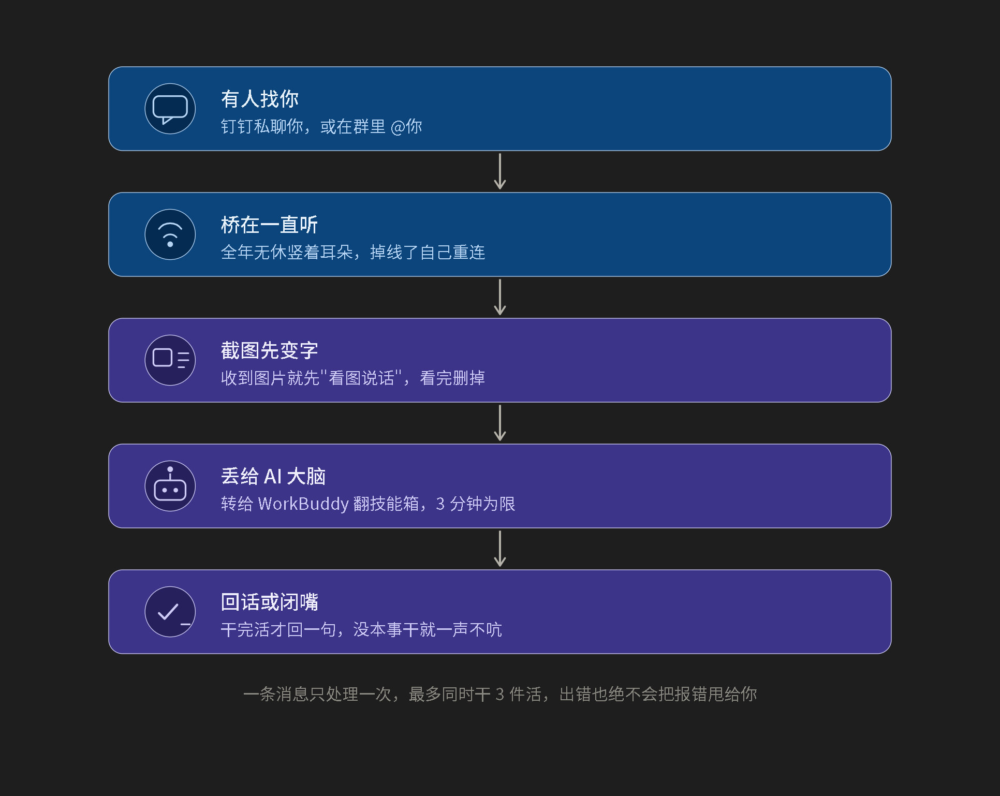

# IMBridge / 即时通讯桥

> 一个常驻进程，把任何即时通讯平台（默认：钉钉）的私聊 / 群消息，转交给本地 AI Agent（默认：WorkBuddy）处理，再把回复送回去。
> 命名空间、程序集、仓库已从 `DingTalkBridge` 重命名为 `IMBridge`，**钉钉只是第一个被接入的 IM 通道**，新增通道、Agent、视觉识别都只需登记适配工厂即可。

**技术栈**：.NET 10（`net10.0`）· C# · 原生 AOT 发布（`PublishAot`，win-x64 产物约 5.7 MB）· Windows



## 它做什么

| 步骤 | 说明 |
| ---- | ---- |
| 1. 有人找你 | 钉钉私聊，或在群里 `@` 你 |
| 2. 桥在一直听 | 全年无休竖着耳朵，掉线了自己重连 |
| 3. 截图先变字 | 收到图片就先"看图说话"，看完删掉 |
| 4. 丢给 AI 大脑 | 转给 WorkBuddy 翻技能箱，3 分钟为限 |
| 5. 回话或闭嘴 | 干完活才回一句，没本事干就一声不吭 |

> 一条消息只处理一次，最多同时干 3 件活，出错也绝不会把报错甩给你。

## 架构分层

```
┌────────────────────────────────────────┐
│  Abstractions        ← 纯接口、契约模型     │
│   IMessageSource / IMessageSink         │
│   IMessageEnricher / IChannelAdapterFactory │
│   IAgentGateway    / IAgentAdapterFactory    │
│   IVisualRecognizerFactory                │
│   IProcessRunner / IStreamingProcessRunner  │
├────────────────────────────────────────┤
│  Domain             ← 入站/出站消息、附件    │
│  Application        ← MessageDispatcher、   │
│                       BridgeWorker、       │
│                       BridgeRegistry        │
├────────────────────────────────────────┤
│  Infrastructure      ← 具体平台与进程实现    │
│   Dws（DingTalk Workspace CLI）         │
│   WorkBuddy（无头 CLI 适配器）            │
│   Media（媒体下载 + 视觉识别）             │
│   Process（带取消的流式子进程）             │
│   Configuration（手工读取 + 旧版兼容）     │
└────────────────────────────────────────┘
```

约束（由架构测试守护）：

- **Domain / Application / Abstractions** 不引用 `Infrastructure` 或 `Microsoft.Extensions.Configuration`；
- **Dws 适配器**不构造、也不依赖 WorkBuddy 或 Gemini 实现；
- **IM 工厂接口**只接收通道自身的 `ChannelConfig`，不接收 `AgentConfig`；
- **配置中出现未登记的 `Type`** 启动即抛错，不静默降级；
- **通道显式选项**总是优先于根级默认值，根级仅在通道未配置时作兜底。

## 快速开始

```bash
# 1. 编译 + 跑回归测试（不需要任何外部服务）
dotnet run --project IMBridge.Tests --configuration Release

# 2. 以 DryRun 模式启动（不会真发消息，便于演练）
dotnet run --project IMBridge --configuration Release

# 3. 原生 AOT 发布（win-x64）
dotnet publish IMBridge/IMBridge.csproj -c Release -r win-x64 -o IMBridge/publish

# 4. 真正运行：编辑 appsettings.json，把 Bridge.DryRun 改为 false
```

> 需要 .NET 10 SDK（`net10.0`）。AOT 发布在 Windows 上还需要 MSVC 生成工具链（Visual Studio 的 "Desktop development with C++" 工作负载）。

> 默认 `appsettings.json` 已是 `DryRun=true` 的安全示例，不带任何真实凭据或本机路径。`OwnerName` 为空、超时 180 秒、并发上限 3。

## 配置

根节点 `Bridge`：

| 字段 | 含义 | 默认 |
| ---- | ---- | ---- |
| `DryRun` | 全局演练开关；为 `true` 时发送动作不会真正发出 | `true` |
| `MaxConcurrentTasks` | 同时处理消息的上限 | `3` |

`Channels.<name>`（IM 通道实例）：

| 字段 | 含义 |
| ---- | ---- |
| `Type` | 通道适配器类型（`dingtalk` 为内置；新增通道在此登记新值） |
| `Agent` | 该通道绑定的 Agent ID（必须存在于 `Agents`） |
| `Vision` | 可选；引用的视觉识别器 ID |
| `EventKeys:0..N` | 钉钉事件类型数组（如 `user_im_message_receive_o2o_all`） |
| `DwsPath` / `DryRun` | 通道内覆盖根级同名键 |

`Agents.<id>`（下游 Agent 实例）：

| 字段 | 含义 |
| ---- | ---- |
| `Type` | Agent 类型（内置 `workbuddy`） |
| 其余键值 | 透传给对应适配工厂（自定义 Agent 可约定新键） |

> 旧版扁平 `Bridge.WorkBuddy` / `Bridge.DwsPath` / `Bridge.EventKeys` 会被自动迁移到 `Channels.dingtalk` 与 `Agents.workbuddy`，但**仅迁移这三种白名单键**，避免无关配置泄漏。

## 扩展点

| 想做的事 | 改哪里 |
| ---- | ---- |
| 接入一个新的 IM（飞书 / Slack / Telegram） | 实现 `IChannelAdapterFactory`，在 `Program.cs` 的 `Channels` 字典里登记 |
| 接入一个新的 Agent | 实现 `IAgentAdapterFactory`，在 `Agents` 字典里登记 |
| 接入新的视觉模型 | 实现 `IVisualRecognizerFactory`，在 `Visuals` 字典里登记 |
| 改 Agent 行为 / 模型 | 在 `appsettings.json` 里给对应 Agent 加新键，工厂自行读取 |

> 应用层、调度核心、消息契约一行都不用改——这就是架构测试兜底的目的。

## 进程安全

- 子进程默认不继承宿主完整环境，只保留运行所需最小 Windows 环境（`PATH` / `SystemRoot` 等）；调用方可显式追加变量。
- 流式会话的 `stderr` 后台排空任务会被观察，**不会被遗忘**导致进程悬挂。
- 取消 / `Dispose` 会强杀所属进程树并等待退出，多次 `Dispose` 幂等。
- 真实进程 Unicode、取消与回收、异常重连回归测试全部使用 `dotnet help` / `powershell.exe` 等本地无害命令，CI 不依赖任何外部服务。

## 测试

```bash
dotnet run --project IMBridge.Tests --configuration Release
```

覆盖：

- 消息路由与隔离（两通道、两 Agent、no-match / failed 沉默、同通道去重、Unicode 透传）
- 路由契约（二元组去重键无分隔符碰撞、富化器不得改变回复目标、绑定一致性拒绝）
- 进程契约（真实进程 Unicode、最小环境继承、取消 / Dispose 回收、Dws 异常重连）
- Worker 契约（agent / sink / enricher 异常后通道继续；宿主取消正常结束）
- 架构契约（分层依赖、通用配置字段白名单、IM 工厂不接 Agent 配置、钉钉适配器不构造 WorkBuddy 视觉）
- 配置继承（显式选项优先、根级默认兜底、旧格式迁移白名单、空配置安全默认）

> 测试工程 `Program.cs` 仍遗留 4 处 `CS8625` 空值警告（与本次重命名无关），不影响功能与发布。

## 项目 / 仓库

- 命名空间：`IMBridge.*`
- 程序集：`IMBridge`、`IMBridge.Tests`
- GitHub：<https://github.com/NeroLiang19/IMBridge>
- License：仅以仓库 `LICENSE` 为准（首次公开未附；如需 MIT/Apache-2.0 等欢迎告知）

## 重命名历史

- 2026-09：项目从 `DingTalkBridge` 重命名为 `IMBridge`，以体现"多通道 IM 桥"的定位。
- 同次提交：把内置钉钉相关类（`DingtalkChannelAdapterFactory`、`DingtalkOptions` 等）保留为钉钉专属命名，避免一个抽象概念被钉钉词汇占据。